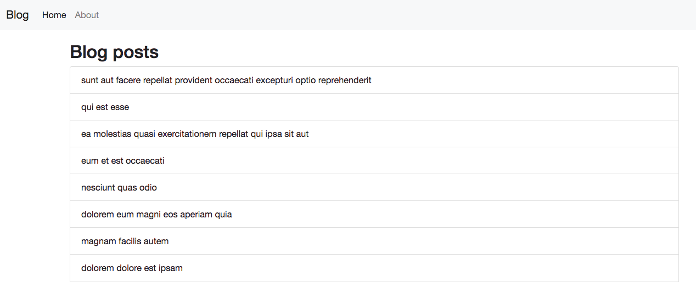

# 作業

## hw1：Todo List

請你用 React 實作出一個 todo list，介面跟功能就參考之前用 jQuery 寫出來的那個就行了。

## hw2：五子棋遊戲

請實作出一個簡單的五子棋遊戲，讓黑棋白棋可以輪流下，並且判定勝負。棋盤的話請用十九路棋盤（19*19），如果想挑戰更進階的，可以試著把棋譜也記錄起來，甚至是做一個輸入棋譜就可以重演整個盤面的小程式。

## hw3：Blog SPA

請做出一個簡單的 Blog SPA，一共有三個頁面：

1. About：隨意顯示一些話
2. 文章列表：可以看到所有文章
3. 單篇文章：可以看到單篇文章內容

API 的話可以用這個：https://jsonplaceholder.typicode.com/posts

圖片可參考：

## hw4：簡答題

1. 為什麼我們需要 React？可以不用嗎？
2. React 的思考模式跟以前的思考模式有什麼不一樣？
2. state 跟 props 的差別在哪裡？
3. 請列出 React 的 lifecycle 以及其代表的意義