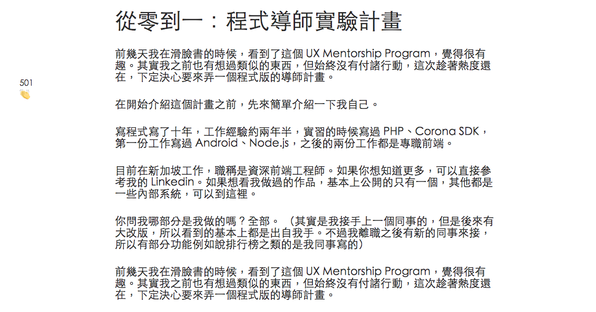

# 作業

## hw1：切版

請切出如下圖的版面：

不需要做到完全一樣，但可以盡你所能做的相似，除此之外，還要支援超基本的 RWD，在手機上看也不會跑版。

你可以觀察[這個網頁](https://lidemy.github.io/mentor-program-kristxeng/homeworks/week2/hw1/)來決定應該如何實作。

### 進階挑戰題

1. 把內容改成一些真的文字（主題自己想，重點是要讓這網站看起來是真的可以用的網站）並美化網站

## hw2：仿 Medium

請切出如下圖的版面：

可以先觀察[這個網頁](https://lidemy.github.io/mentor-program-kristxeng/homeworks/week2/hw2)。

文字可以自己換成其他的，只要效果有達到就好。一樣要支援簡易的 RWD，在手機上看不會跑版（拍手會自動隱藏）。

### 進階挑戰題

1. 去觀察 Medium 的網站，連下面的推薦文章一起實作
2. 去觀察 Medium 的網站，左側的功能不只拍手，連社交分享功能一起切出來
3. 去觀察 Medium 的網站，並加上網頁上方的 nav bar

## hw3：CSS Diner

請完成這個小遊戲：https://flukeout.github.io/

## hw4：Flexbox Froggy

請完成這個小遊戲：http://flexboxfroggy.com/

## hw5：簡答題

請將答案寫在 [hw5.md](hw5.md)。

1. 請找出三個課程裡面沒提到的 HTML 標籤並一一說明作用。
2. 請問什麼是盒模型（box modal）？
3. 請問 display: inline, block 跟 inline-block 的差別是什麼？什麼時機點會用到？
4. 請問 position: static, relative, absolute 跟 fixed 的差別是什麼？分別各舉一個會用到的場合

## 挑戰題

[Hacker News](https://news.ycombinator.com/) 是一個很知名的網站，上面有著各種與科技相關的資訊。現在請你看著這個網站，把它切出來。

或是如果你想把它變得更美，也可以試試看。

## 超級挑戰題

打開你的 Facebook，看著它。

打開你的文字編輯器，開始依樣畫葫蘆，切出一個 Facebook。

你只要切出你現在看得到的版面就好，不用考慮往下滑什麼的。但如果你切完還是心有餘力，那也可以試試看。
