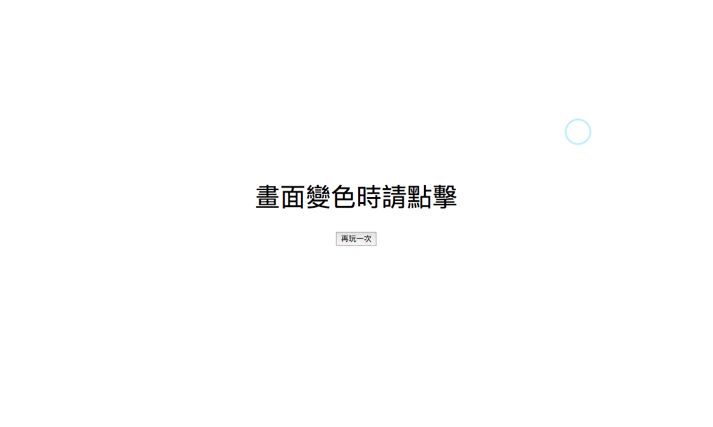
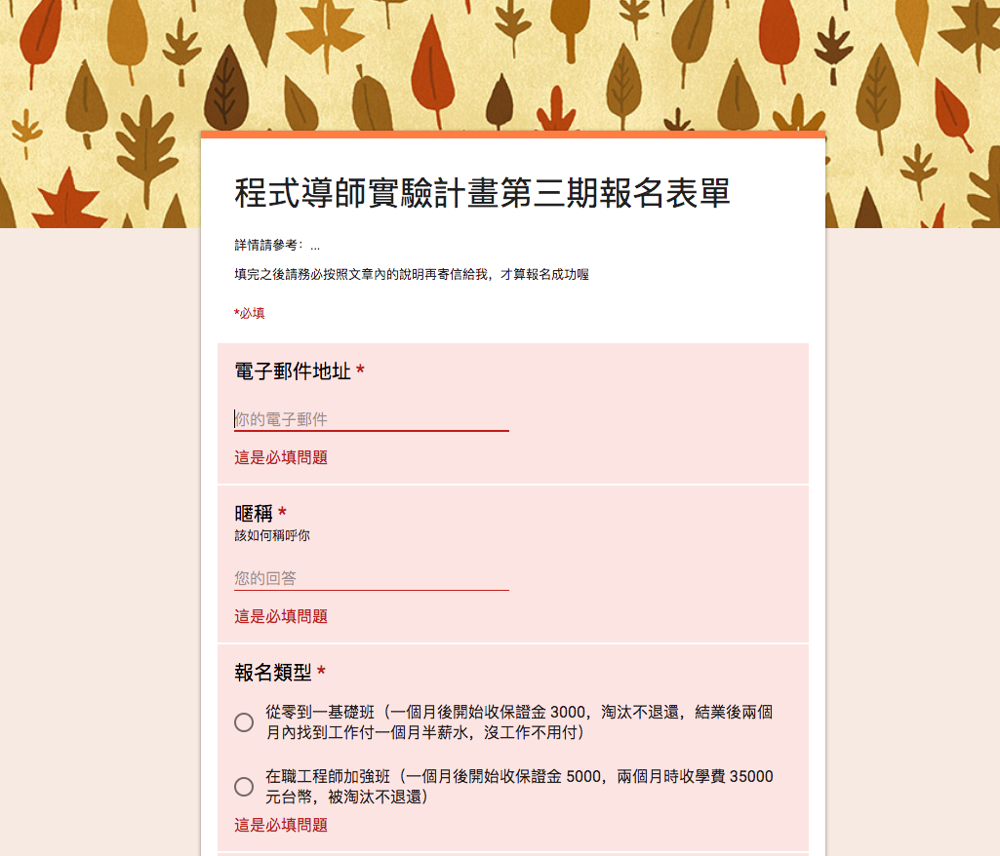
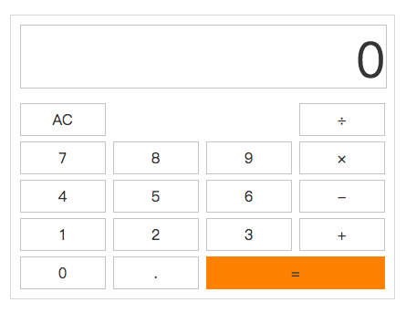
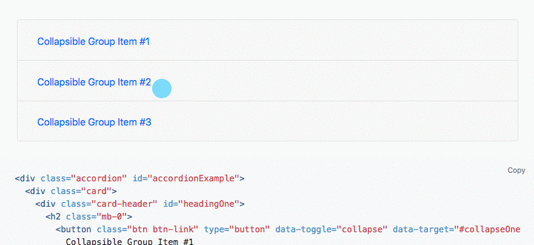
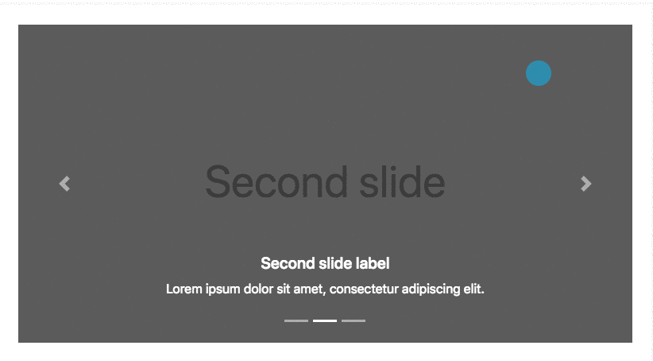

# 作業

## hw1：反應力小遊戲

不知道大家有沒有玩過一種小遊戲，那就是畫面會在隨機的時間變色，你看到變色的那瞬間就要點擊螢幕，直接先讓大家看範例：

點擊完之後會彈出一個視窗跟你說從變色到你按下按鈕總共多少秒，若是點的時候畫面還沒變色，會彈出視窗跟你說你失敗了。無論成功或失敗都可以再玩一次。

這個作業就是要讓大家實作這個小遊戲，做出來以後也可以來跟朋友比賽，看誰的反應力快！

### 作業規範

1. 變色的隨機時間請設在 1~3 秒，否則會太長跟太短
2. 再玩一次的按鈕要在遊戲結束時才會出現
3. 若是失敗，畫面就不會再變色了，除非你點選再玩一次
4. 成功以後如果再點一次畫面，不會有任何反應

### 作業提示

1. 可以先不考慮再玩一次的功能，先實作一次性的會比較簡單
2. 這題看似不難，但有滿多細節要注意，詳情請參考上面的作業規範

### 進階挑戰題

1. 畫面變色的時候不是變成固定顏色，而是會隨機變一個顏色
2. 原本是偵測滑鼠左鍵點擊，改成用鍵盤按下空白鍵也可以玩
3. 用鍵盤按下 r 可以自動觸發再玩一次
4. 會記下自己所有紀錄的前三名（重新整理就會消失）並顯示在畫面上

## hw2：仿 Google 表單

請實作出你們當初報名時所填寫的表單：https://docs.google.com/forms/d/e/1FAIpQLSf_VezMf-V20hMDYTNEM0LEkuztIg-ZIsSI9Zy9xLAwGYzxGA/viewform?usp=sf_link

可參考範例：[https://lidemy.github.io/mentor-program-pychiang/homeworks/week4/hw2/](https://lidemy.github.io/mentor-program-pychiang/homeworks/week4/hw2/)（第一期學生 pychiang 的作品）

背景隨便用一個顏色就好了，重點是實做出表單內容以及驗證。UI 可以不用完全一樣，只要功能有做出來就好，UI 只是讓你參考的。

### 作業規範

1. 文字輸入框可以選擇必填或是非必填
2. 送出表單時，必填的地方如果空白，要能夠把背景變紅色並且提示使用者
3. 成功提交之後，把表單的資料輸出在 console，並且用`alert`跳出提示即可

### 作業提示

1. 先切好版，然後驗證一個一個來做，不要一次想把所有驗證做完

### 進階挑戰題

1. 切的跟 Google 表單幾乎一模一樣
2. 支援 RWD

## hw3：計算機

可參考範例：[https://lidemy.github.io/mentor-program-kristxeng/homeworks/week4/hw1/](https://lidemy.github.io/mentor-program-kristxeng/homeworks/week4/hw1/)（第一期學生 Kris 的作品）

請用你在之前學會的網頁技術（HTML, CSS, JavaScript）打造出一個簡單的計算機，功能如下：

1. 要有 0 到 9
2. 要有加減乘除
3. 要能夠清空

計算機這一題其實要難可以到很難，這個作業的目的只是想讓你熟悉基本操作而已，只要以下的範例能夠通過就好：

### 測試1

1. 按下 123
2. 按下 +
2. 按下 456
3. 按下 =
4. 出現 579

### 測試2

1. 按下 20
2. 按下 -
2. 按下 25
3. 按下 =
4. 出現 -5

### 作業提示

1. 不要想得太難，只要加減能夠成功就行了
2. 先想怎麼通過上面附的兩個測試就好

### 進階挑戰題

1. 實作出具有完整功能的計算機，加減乘除都沒問題
2. 重構程式碼，用迴圈或是 delegate 的方式處理 click event

## hw4：簡答題

1. 什麼是 DOM？
2. 事件傳遞機制的順序是什麼；什麼是冒泡，什麼又是捕獲？
3. 什麼是 event delegation，為什麼我們需要它？
4. `event.preventDefault()` 跟 `event.stopPropagation()` 差在哪裡，可以舉個範例嗎？

請將答案寫在 [hw4.md](hw4.md)。

## 挑戰題

參考 Bootstrap，實作出一個 Accordion（手風琴）元件，可參考：https://getbootstrap.com/docs/4.3/components/collapse/#accordion-example

備註：只能使用 HTML、CSS 與 JavaScript，禁止使用任何套件

## 超級挑戰題

參考 Bootstrap，實作出一個 Carousel 元件，可參考：https://getbootstrap.com/docs/4.3/components/carousel/#with-captions

備註：只能使用 HTML、CSS 與 JavaScript，禁止使用任何套件

