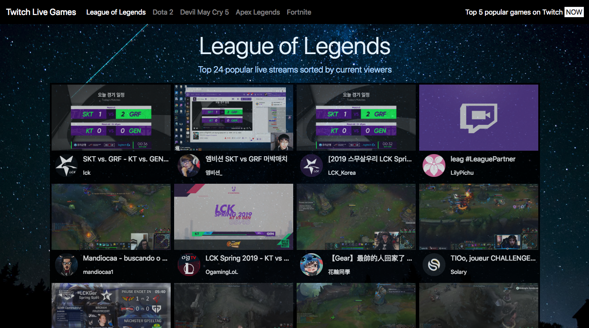

# 作業

## hw1：抽獎程式

住你家樓上的王媽媽最近剛開了火鍋店，想要讓每個來消費的客人都能夠抽獎，可是他想要創新一點，不想要用實體的籤，想要靠著程式來作抽獎，而且希望每個獎項都有固定的機率。

她已經委託一間公司寫好了抽獎的 API，而你要幫忙的地方是實作前端介面並且跟 API 串接，這樣子就是一個完整的抽獎程式了！就衝著王媽媽答應你做完後可以獲得一客免費的 A5 和牛火鍋這點，說什麼也要把這個網站做好！

這是 API 的網址：https://dvwhnbka7d.execute-api.us-east-1.amazonaws.com/default/lottery

用 GET 即可，API 會回傳一個 JSON 格式的物件，內容為：

```
{
  prize: "獎項名稱"
}
```

API 會按照機率回傳不同的獎項名稱，請你針對不同的獎項名稱做處理。

獎項名稱一共有四種：FIRST、SECOND、THIRD 以及 NONE。

1. FIRST，頭獎，在網頁上顯示字樣：「恭喜你中頭獎了！日本東京來回雙人遊！」，並且把背景改成天空色，網頁上放一張飛機的圖片。
2. SECOND，二獎，在網頁上顯示字樣：「二獎！90 吋電視一台！」，並且在網頁上放一張電視的圖片。
3. THIRD，三獎，在網頁上顯示字樣：「恭喜你抽中三獎：知名 YouTuber 簽名握手會入場券一張，bang！」，並且在網頁上放 YouTube 的 Logo。
4. NONE，銘謝惠顧，在網頁上顯示字樣：「銘謝惠顧」，並起把整個網頁變成黑底白字。

有一點要特別注意，API 偶爾可能會不太穩定，會回傳錯誤。如果發生任何預期之外的情形（回傳的獎項不是以上四種，或是 Server 直接回傳錯誤），請跳出提示視窗（alert）：「系統不穩定，請再試一次」。

### 進階挑戰題

請問這四種獎項的機率為何？

## hw2：留言板

上次你幫王媽媽寫的抽獎程式大受好評，成功吸引了許多消費人潮，而 A5 和牛火鍋的滋味你也念念不忘，希望有機會能夠再吃一次。

剛好，王媽媽又有了新的需求，他希望可以做一個留言板，讓客人們都可以上去留言，他就可以從這些留言中得知店裡哪邊做得好，哪邊做不好，並且加以改善。同樣地，他也去找了外包公司把 API 的部分搞定了，所以你只要負責前端的部分即可。

老樣子，這次做完一樣會有 A5 和牛火鍋可以吃。

底下是一個留言板的 API，主要的功能有兩個：撈取留言與新增留言，現在請你做一個頁面，可以讓他們新增留言以及看到最新的 20 則留言。

Base URL：https://lidemy-book-store.herokuapp.com/

| 說明     | Method | path       | 參數                   | 範例             |
|--------|--------|------------|----------------------|----------------|
| 獲取所有留言 | GET    | /posts     | _limit:限制回傳資料數量, _sort:要排序的欄位, _order:順序，可填 asc 或 desc  | /posts?_limit=20 |
| 新增留言   | POST   | /posts     | content: 內容 | 無              |


### 進階挑戰題

實作分頁功能，讓他們可以點不同頁數來看不同的留言。

## hw3：再戰 Twitch API

還記得之前你幫果凍做的小程式嗎？可以看到 Twitch 上面熱門的遊戲，讓他從中挑選一個並且直播。這個成效很不錯，但是身為一個實況主，他又面臨了新的挑戰。

最近又太多太多實況主了，每個都有不同的特色，除了精進自己的實力以外，也要觀察一下競爭對手在做什麼。於是，他想拜託你寫一個網頁，可以顯示出某個特定遊戲的一些熱門實況，好讓他能夠方便觀察競爭對手。

請串接 [Twitch API v5](https://dev.twitch.tv/docs/v5/)，顯示出 League of Legends 目前正在直播的前 20 個實況。


### 作業提示

1. [Twitch API](https://dev.twitch.tv/docs/v5/) 裡面有一個 API 是可以拿到現在正在直播的某個遊戲底下的資料，API 的描述是「Gets a list of live streams.」，看到這行就代表你找對 API 了。
2. API 要帶的參數有一個 `game` 的欄位，請帶`League%20of%20Legends`
3. 請顯示 20 個實況，不多不少，要剛好 20 個

附註：Twitch API 有兩個版本，v5 是舊版，但這個作業建議用 v5


## 進階挑戰題

這個頁面最底下加上一個按鈕：「載入更多」，點了之後會繼續載入之後的 20 個實況。按鈕不會消失，除非已經沒有更多的實況可以載入了。

## hw4：簡答題

1. 什麼是 Ajax？
2. 用 Ajax 與我們用表單送出資料的差別在哪？
3. JSONP 是什麼？
4. 要如何存取跨網域的 API？
5. 為什麼我們在第四週時沒碰到跨網域的問題，這週卻碰到了？

請將答案寫在 [hw4.md](hw4.md)。

### 挑戰題

做出一個像這樣的網頁：https://cwenwen.github.io/APIsPractice/Twitch_API/



可以切換不同的遊戲，顯示不同遊戲的熱門實況。

### 超級挑戰題

同上，但新增兩個功能：

1. 無限滾動（Infinite scroll），當你頁面往下捲到底的時候，會自動載入新的實況
2. 導覽列新增一個搜尋欄，可以搜尋你想顯示的遊戲，搜尋的時候必須要有自動完成的功能，例如說我打 Lea 就會出現 League of Legends，按搜尋之後可以看到這個遊戲的熱門實況

