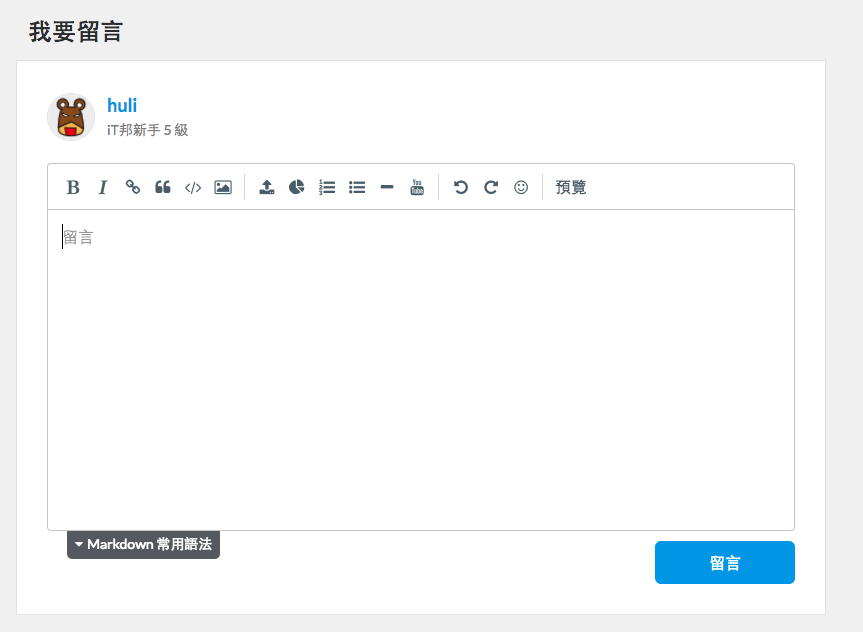
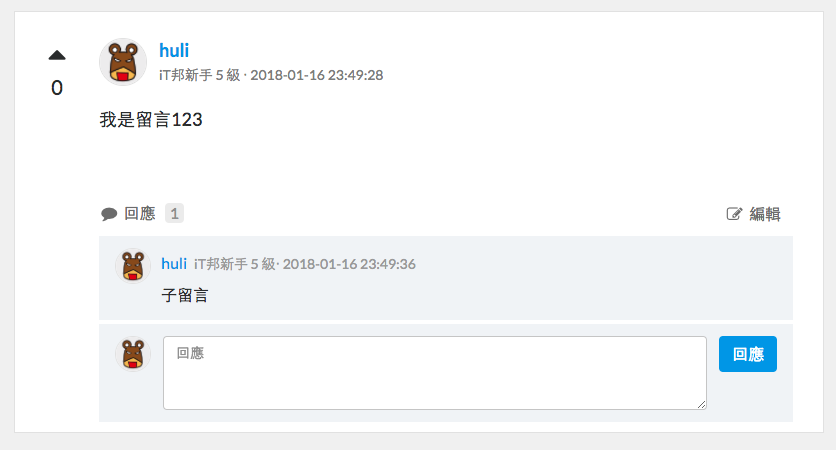
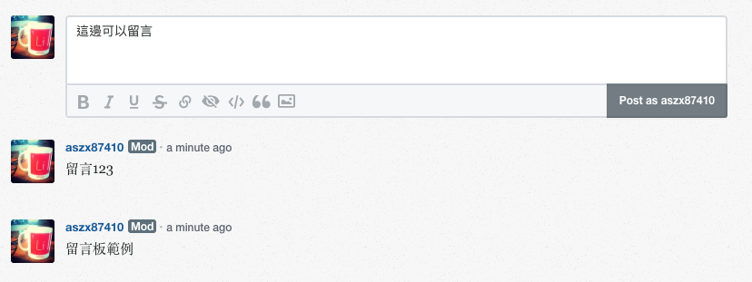

# 作業

### 注意

hw2 與 hw3 寫在一起就好，不用分開。然後記得把你連線到資料庫的檔案（conn.php），加入`.gitignore`，否則這檔案會被放到 GitHub 上，大家就知道資料庫的帳號密碼了。

另外，請你在留言板的最上方加註一行警語：「本站為練習用網站，因教學用途刻意忽略資安的實作，註冊時請勿使用任何真實的帳號或密碼」，加警語的目的是因為這週要做的網站極度不安全，很有可能被駭客拿到整個資料庫的資料，因此請切記在這網頁上不要輸入任何敏感資訊。


## hw1：設計留言板 Database 結構

在開始動手做之前，需要先花點時間想好怎麼樣規劃你的資料庫結構，確定沒問題以後再下去動手實作。

我們接下來要做的作業是：留言板。

可以參考以下需求來想要怎麼設計資料庫結構：

1. 身為使用者，在新增留言時應該可以輸入暱稱跟留言內容
2. 身為系統，應該顯示出留言者的暱稱跟留言內容以及留言時間
3. 身為系統，顯示留言時應該按照時間排序，最後留的顯示在最上面
4. 身為系統，應該只顯示最新的前五十筆留言

請把答案依照格式寫在：[hw1.md](hw1.md)

## hw2：留言板

請實作出一個簡易的留言版頁面，需要以下元素：

1. 有一個留言的區塊可以新增留言
2. 能夠顯示留言

可參考以下示意圖（擷取自[iT 邦幫忙](https://ithelp.ithome.com.tw/articles/10185630)）




或是這個：



不用做得像上面那麼精緻，只要基本功能有達成就好。例如說留言的區塊只要能輸入純文字就夠了，留言區左邊的那個按讚數也可以不用實作，子留言也不必實作。

可以參考下面附的需求來實作：

1. 身為使用者，在新增留言時應該可以輸入暱稱跟留言內容
2. 身為系統，應該顯示出留言者的暱稱跟留言內容以及留言時間
3. 身為系統，顯示留言時應該按照時間排序，最後留的顯示在最上面
4. 身為系統，應該只顯示最新的前五十筆留言

## hw3：會員系統

上面的留言板系統完成之後，要來多加一個功能，那就是會員系統。現在的系統是開放每個訪客可以自己取暱稱，但有了會員系統以後，必須要是會員才能夠留言。

這個時候問題就來了，應該要怎麼實作會員系統呢？

最大的問題是：

> 每個 Request 之間都是獨立的，在會員登入之後，你要怎麼知道上一個 Request 跟現在的是同一個人呢？

意思就是，你要怎麼知道使用者已經登入了？你要怎麼記錄這個狀態？

在瀏覽器這邊，我們有個東西可以使用，叫做 Cookie，其實它就是可以讓瀏覽器儲存資料的地方。而且呢，Server 端可以主動把資料存到 Cookie 去。

在 PHP 裡面，你可以使用`setcookie`函式達成這件事。

``` php
// 設定一個 24 小時之後會過期的 Cookie
setcookie("member_id", "001", time()+3600*24);
```

如此一來，在會員登入之後，我們就能夠利用 setcookie，把會員的資料存到使用者瀏覽器的 cookie 裡面。而瀏覽器在送出 request 的時候，也會把 cookie 的內容一起帶上來，你可以用 `$_COOKIE[$cookie_name]` 來取得。

``` php
if(!isset($_COOKIE["member_id"])) {
    echo "not login";
} else {
    echo "member id: " . $_COOKIE["member_id"];
}
```

有了 Cookie 之後，我們就能夠知道使用者是不是登入狀態了。那如果要登出的話呢？也很簡單，只要把 cookie 的內容清掉就好了（換句話說，就是設定一個內容為空的 Cookie），這樣子使用者下次再拜訪頁面時，就會跳出需要登入的提示了。

會員系統的資料庫設計可參考以下的結構：

Table 名稱：users

| 欄位名稱 | 欄位型態 | 說明 |
|----------|----------|------|
|  id  |    integer      | 使用者 id     |
| username   | VARCHAR(16) | 帳號  |
| password   | VARCHAR(16) | 密碼  |
| nickname   | VARCHAR(64) | 暱稱  |

接著，你需要實作的就是以下幾個頁面：

1. 註冊頁面
2. 登入頁面
3. 登出頁面

以及把原本的留言板改成需要登入才能夠留言，並且自動帶入使用者的暱稱。

## hw4：簡答題

1. 資料庫欄位型態 VARCHAR 跟 TEXT 的差別是什麼
2. Cookie 是什麼？在 HTTP 這一層要怎麼設定 Cookie，瀏覽器又會以什麼形式帶去 Server？
3. 我們本週實作的會員系統，你能夠想到什麼潛在的問題嗎？

請將答案寫在 [hw4.md](hw4.md)。

## 挑戰題

請實作出 BE101 課程中 Job Board 職缺報報與 Blog 部落格裡的進階練習。

## 超級挑戰題

請實作出 BE101 課程中 Job Board 職缺報報與 Blog 部落格裡的魔王練習。
